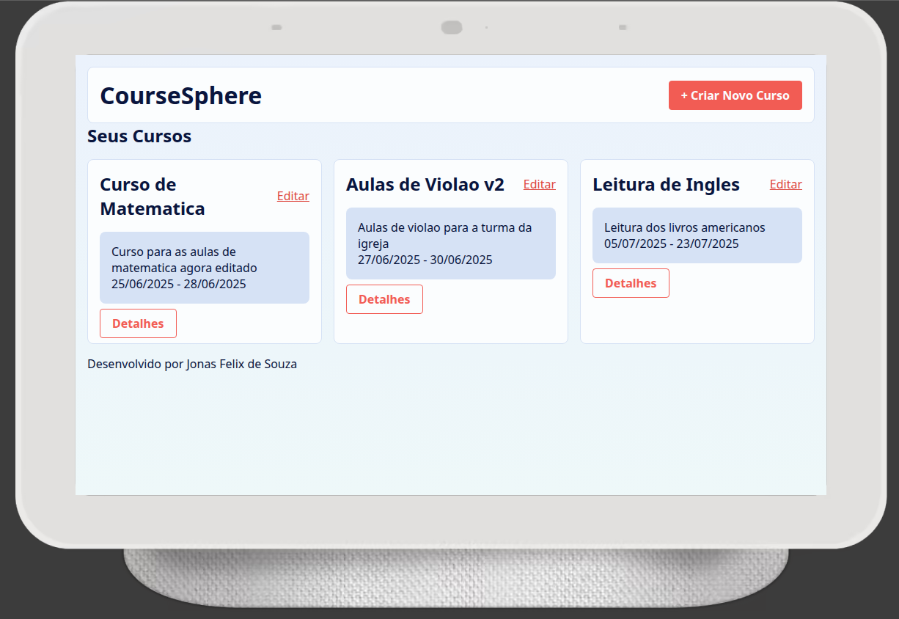
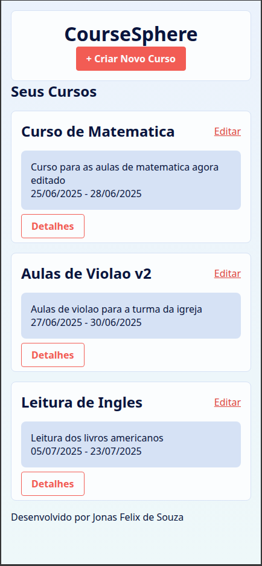
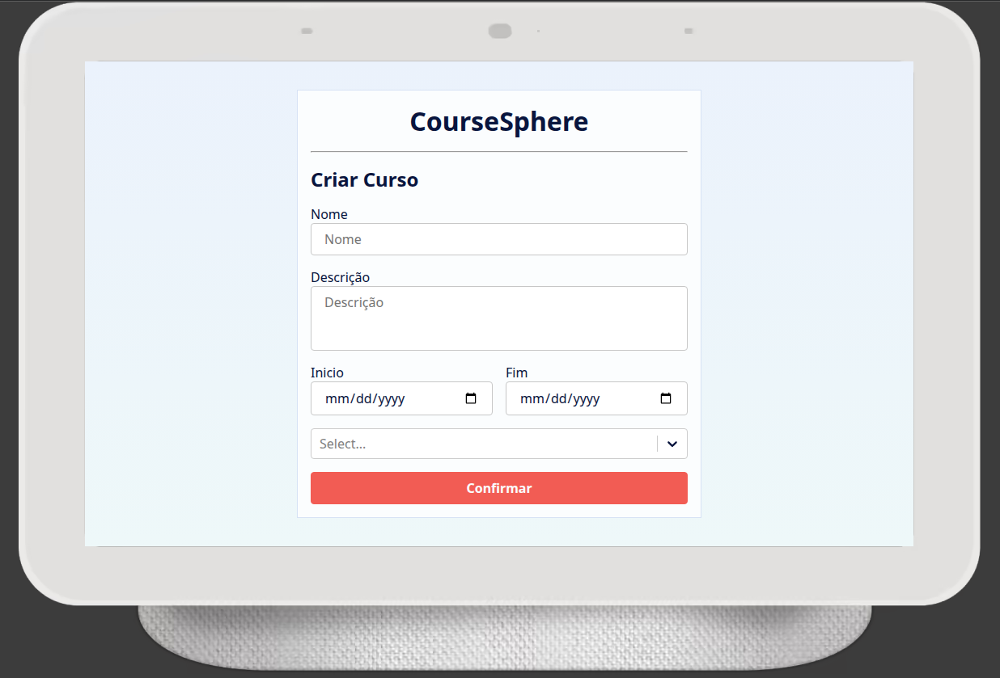
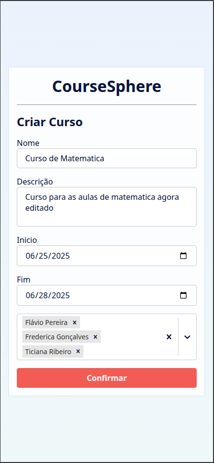
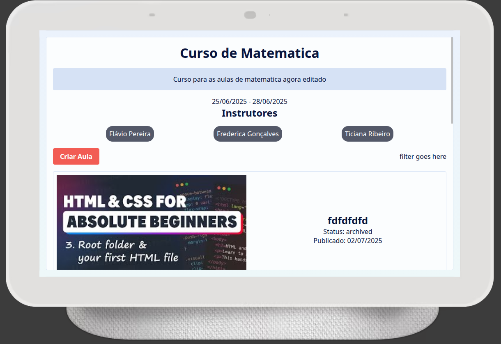
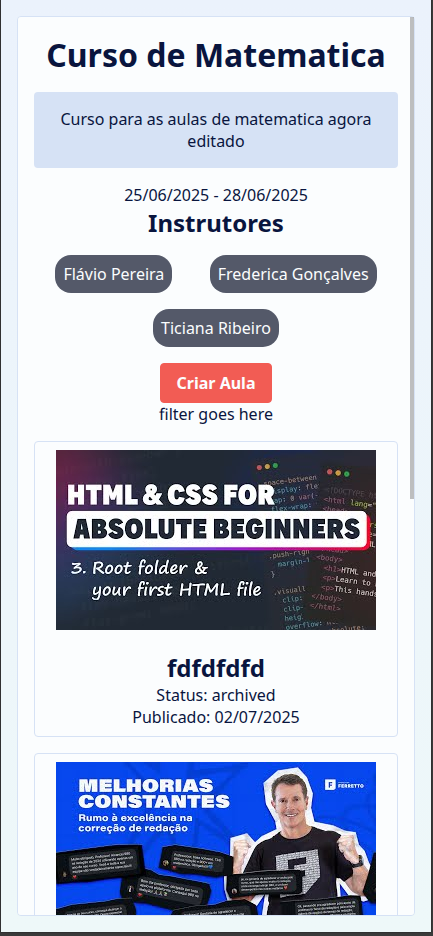

# CourseSphere

[](https://nodejs.org/)  
[](https://react.dev/)
[](https://vitejs.dev/)

> **CourseSphere** é uma **plataforma web para gerenciamento colaborativo de cursos e aulas**.  
> Construída em **React + Vite** com **styled-components**, utiliza **JSON Server** como API mock para facilitar o desenvolvimento local.

---

> **Atenção!** O deploy ainda não esta com o mock back-end (json-server) no ar, irei adicionar o mais rápido possível. Sinta-se a vontade para verificar o sistemas localmente no meio tempo.

<div style="height: 400px; display:flex; overflow-x: auto; overflow-y: hidden;">
    
    
    
    
      
    
</div>

## Índice

1. [Funcionalidades](#funcionalidades)
2. [Tecnologias](#tecnologias)
3. [Pré-requisitos](#pré-requisitos)
4. [Instalação](#instalação)
5. [Planos Futuros](#planos-futuros)

---

## Funcionalidades

-   📚 **Lista de cursos** com nome, descrição, datas e instrutores.
-   🔍 **Detalhe de curso** exibindo todas as aulas associadas.
-   📝 **CRUD mock** de cursos e aulas via JSON Server.
-   🔄 Navegação **SPA** com React Router.
-   🎨 **Estilização modular** usando styled-components.

---

## Tecnologias

| Camada              | Tech / Lib                       | Descrição                           |
| ------------------- | -------------------------------- | ----------------------------------- |
| **Frontend**        | React 18, Vite, React Router DOM | UI e roteamento                     |
| **Estilo**          | styled-components                | CSS-in-JS escopado a componentes    |
| **Back-end (mock)** | JSON Server                      | REST fake a partir de `db.json`     |
| **Qualidade**       | ESLint, Prettier                 | Padronização e formatação de código |
| **Empacotamento**   | Vite                             | DevServer rápido + build otimizado  |

---

## Pré-requisitos

-   **Node.js 18 LTS** ou superior
-   **npm 9+**

---

## Instalação

```bash
# clone o repositório
git clone https://github.com/Jonas-petty/CourseSphere.git
cd CourseSphere

# instale as dependências
npm install

# inicie o mock de API (porta 3000)
npx json-server db.json

# em paralelo, rode a aplicação (porta 5173)
npm run dev
```

> -   Abra http://localhost:5173 no navegador.

## Planos Futuros

-   Deletar Curso e Aula;
-   Gerenciar Instrutores;
-   Adicionar mais feedbacks de interação;
-   Adicionar filtros;
-   Aprimorar UI/UX

<p align="center">Made with 💙 by Jonas Felix</p>
